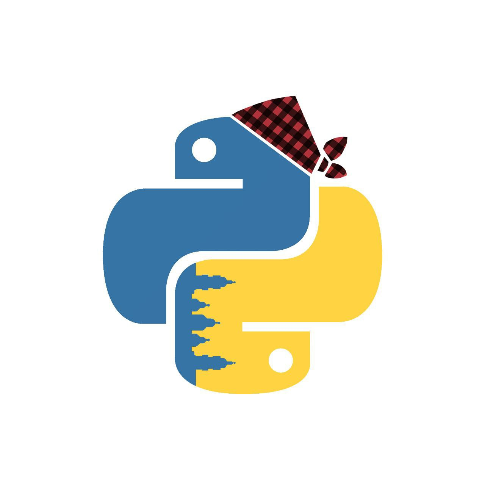

# Python Zaragoza --- Comunidad Python Zaragoza

Sitio web oficial de la comunidad **Python Zaragoza** creado con
[Reflex](https://reflex.dev/) y gestionado con
[uv](https://docs.astral.sh/uv/).



## 🚀 Qué es Python Zaragoza

Python Zaragoza es una comunidad local de personas interesadas en **Python** en
Zaragoza. Organizamos:

- 📅 **Meetups**: charlas y networking.\
- 🛠️ **Talleres**: sesiones prácticas para todos los niveles.\
- 🤝 **Proyectos**: iniciativas abiertas y colaborativas.

Nuestro objetivo es fomentar el uso y aprendizaje de Python en un
ambiente abierto y amigable.

------------------------------------------------------------------------

## 📂 Estructura del proyecto

    pyzgz/
      ├── pyzgz/           # Código de la aplicación Reflex
      │   ├── pyzgz.py     # Definición de páginas y layouts
      │   └── __init__.py
      ├── assets/          # Imágenes y recursos estáticos (logo, favicon…)
      ├── data/            # Archivos de datos (cfp.json, contactos…)
      ├── rxconfig.py      # Configuración de Reflex
      ├── pyproject.toml   # Dependencias y metadatos
      └── README.md

------------------------------------------------------------------------

## 🛠️ Desarrollo local

1. **Clona el repositorio:**

    ``` bash
    git clone https://github.com/tuusuario/pyzgz.git
    cd pyzgz
    ```

2. **Instala dependencias con uv:**

    ``` bash
    uv sync
    ```

3. **Arranca el servidor:**

    ``` bash
    uvx reflex run
    ```

    Luego abre <http://localhost:3000>.

4. **Limpieza de caché (si hay errores raros de HMR):**

    ``` bash
    rm -rf .web
    ```

------------------------------------------------------------------------

## 🌐 Despliegue

### GitHub Pages (estático)

1. Genera el build:

    ``` bash
    uvx reflex export --frontend-only
    ```

    Esto crea un directorio `./.web/_static` con los archivos listos
    para publicar.

2. Configura un workflow de GitHub Actions para que:

    - Ejecute `reflex export --frontend-only`.
    - Publique `./.web/_static` en GitHub Pages.

*(el archivo `.github/workflows/deploy.yml` ya está preparado en este
repo).*

------------------------------------------------------------------------

## 📬 Formularios

- **Charlas (CFP):** los formularios se guardan en `data/cfp.json` en
    modo servidor.\

- **Contacto**

------------------------------------------------------------------------

## ⚙️ Configuración

Variables de entorno principales:

``` bash
# Base de datos (si usas SQLite o Postgres con sqlmodel)
DATABASE_URL=sqlite:///pyzgz.db

# Meetup (solo si usas API desde backend)
MEETUP_GROUP=python-zaragoza
MEETUP_TOKEN=<tu_token_oauth2>

```

Guárdalas en `.env` (usa
[python-dotenv](https://pypi.org/project/python-dotenv/)).

------------------------------------------------------------------------

## 📜 Licencia

[MIT](LICENSE)

------------------------------------------------------------------------

## 🗺️ Roadmap

- [x] **Estructura inicial de páginas**: home, comunity, about,
    contact, blog, events, talks(CFP).\
- [ ] **Mensajes de estado persistentes**: mejorar UX al navegar entre
    páginas.\
- [ ] **Obtener eventos de Meetup**:
  - Server: consumir API GraphQL con `MEETUP_TOKEN`.\
  - Static: preconstruir `assets/events.json` en GitHub Actions.\
- [ ] **SEO y accesibilidad**: meta tags, OpenGraph, manifest,
    favicon.\
- [ ] **Diseño visual mejorado**: tema claro/oscuro, estilos propios.\
- [ ] **Automatizar despliegue** en GitHub Pages con workflow
    estable.\
- [ ] **Traducción opcional** al inglés.

------------------------------------------------------------------------

**Made with ❤️ in Zaragoza.**

